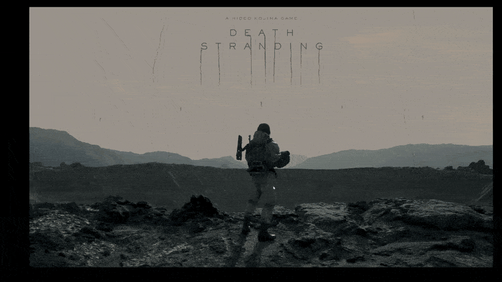
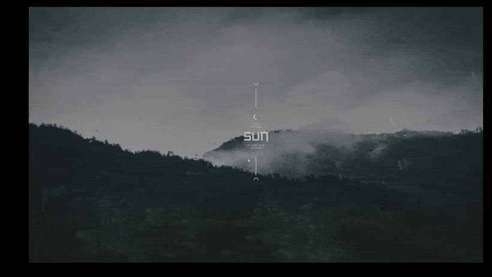
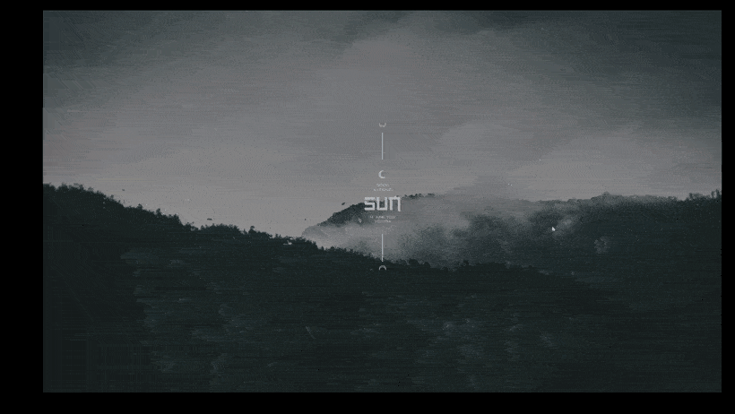

# Polaris

桌面太过杂乱不美观？桌面快捷方式挡住你的动态壁纸？Windows任务栏不好看？  

北极星(Polaris)是一款常驻系统托盘的应用程序坞。您可以把应用程序的快捷方式添加进程序坞中，当鼠标移到屏幕边缘时弹出快捷程序坞，或按住触发键（默认右Alt）即可弹出主程序坞，快速启动你常用的应用、文件夹与系统位置，松开触发键即收起，也可以通过windows触摸板设置三指点击绑定Ctrl+4，即可使用触控板三指点击呼出主程序坞。目前有“土星环”和“液态玻璃”两个主题可供选择。它基于 .NET 9 + WPF 构建。

## 功能特性

- **快捷启动**：鼠标移动到屏幕左侧/右侧/顶部/底部，程序坞自动弹出，点击图标即可启动对应项目，启动项目后程序坞自动隐藏。
- **多主题（待更新）**：
  - **土星环（saturn）**：以土星行星 + 多层土星环的方式排布图标，自带光晕与旋转动画。
  - **液态玻璃（liquidglass）**：半透明的方正圆角「液态玻璃」面板。
- **多种启动项**：支持普通可执行文件、快捷方式、以及 Shell 命名空间项（此电脑、文件资源管理器、回收站等）。
- **运行中应用高亮**：自动追踪正在运行的应用并以流光/绿色呼吸灯标记。
- **窗口预览**：可对正在运行的应用提供窗口预览。
- **全局触发键**：可使用快捷键、绑定的触摸板行为、鼠标光标等方式触发。










## 环境要求

- Windows 10 / 11
- **运行发布版**：[.NET 9 桌面运行时](https://dotnet.microsoft.com/download/dotnet/9.0)（从 Releases 下载的框架依赖单文件版需要它）
  ```powershell
  winget install Microsoft.DotNet.DesktopRuntime.9
  ```
- **从源码构建**：[.NET 9 SDK](https://dotnet.microsoft.com/)（目标框架 `net9.0-windows`，使用 WPF + Windows Forms）

## 构建与运行

```powershell
# 还原依赖并运行（Debug）
dotnet run --project Polaris.csproj

# 构建 Release 版本
dotnet build -c Release
```

### 发布（框架依赖单文件）

仓库内提供了发布脚本，产物为框架依赖单文件版（体积小，需目标电脑安装 .NET 9 桌面运行时）：

```powershell
# 仅构建并打包为 zip（输出到 publish-fd/）
./publish-fd.ps1

```

## 使用方法

1. 启动 Polaris 后，它会驻留在系统托盘。
2. 「按住显示」的触发键默认为右Alt，「切换显示」的触发键为Ctrl+4，也可通过将鼠标移至屏幕边缘(默认底部)触发。
3. 程序坞分为 「主程序坞」和 「快捷程序坞」，「主程序坞」通快捷键触发，「快捷程序坞」坞则通过鼠标移至屏幕边缘触发。
4. 「主程序坞」分为「常驻应用区」和「非常驻应用区」(土星主题的内环、玻璃主题的框内区域为常驻应用区)。
5. 「快捷程序坞」分为「常驻应用区」和「运行区」用分割线隔开，「运行区」会将正在运行且未添加进常驻应用区的程序显示出来。
6. 通过将快捷方式图标拖拽进/出程序坞来添加/删除启动项，，添加进「常驻应用区」的图标会显示在「快捷程序坞」中。
7. 点击图标启动对应程序 / 文件夹 / 系统位置，也可通过鼠标悬停在图标上选择缩略悬窗打开对应窗口。
8. 右键点击托盘图标可打开**设置**窗口，在此切换主题、调整外观与触发键、配置开机自启等，可以通过检查更新按钮进行在线更新。
9. 在Windows触控板设置中将三指点击录制为Ctrl+4，即可通过三指点击触控板弹出「主程序坞」，再次三指点击关闭「主程序坞」。
**推荐将windows任务栏对齐方式设置为靠左并自动隐藏**

## 配置

应用配置以 JSON 形式持久化保存。设置项涵盖：启动项列表、当前主题、面板透明度 / 颜色 / 强调色 / 字体色、图标尺寸、单环最大图标数、内环图标数、触发键、开机自启等。每个主题的透明度与图标尺寸会被单独记忆，切换主题时自动恢复。

